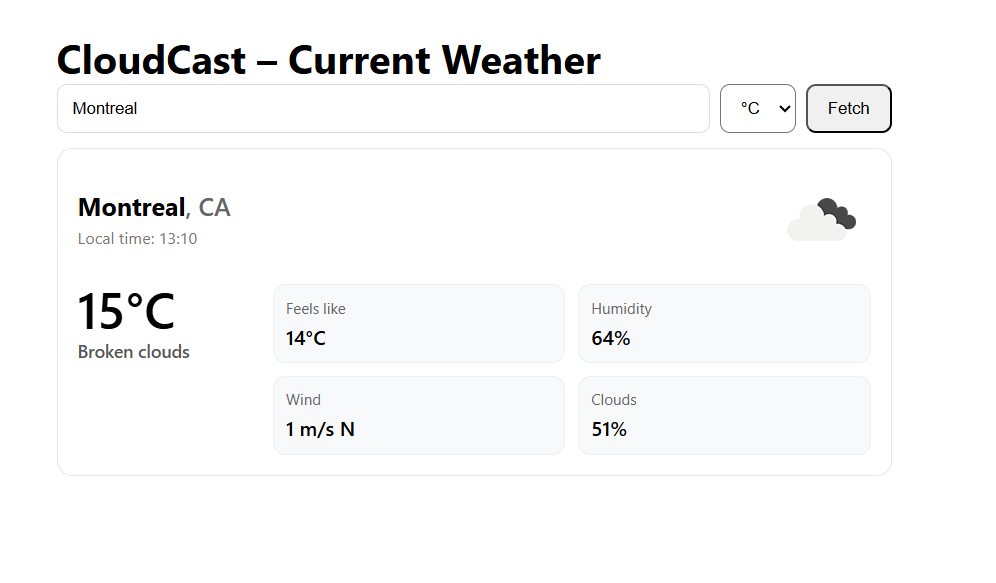

# CloudCast ☁️

Your modern weather companion — live forecasts, dynamic visuals, and a clean interface.



## 🌦️ Overview

**CloudCast** is a modern weather app built with **React.js** that delivers real-time weather updates and 5-day forecasts.  
It features dynamic visuals that adapt to the weather and time of the day, giving users an immersive experience while staying informed.

The project is deployed to a Vercel website [(Click here)](https://cloudcast-one.vercel.app/) for you to test the app right away!

---

## ✨ Features

- **OpenWeather API Integration** – Get current weather and 5-day forecast data for any location in real time.
- **Current Weather Display** – Beautiful card view showing temperature, humidity, wind, and more.
- **Location Search** – Quickly find forecasts by entering a city or location name.
- **Unit Toggle** – Switch easily between °C and °F.
- **Dynamic Backgrounds** – Backgrounds automatically adjust to match weather conditions (sunny, rainy, cloudy, etc.) and local time at the searched city : dark background at night
- **5-Days Forecast** – View detailed daily and hourly forecasts in a clean, card-based layout.
- **(In Progress) Responsive Design** – Optimized for both desktop and mobile screens.

---

## 🛠️ Tech Stack

- **Frontend:** React.js v.19
- **Styling:** CSS + CSS Modules
- **API:** OpenWeatherMap API
- **Linting & Formatting:** ESLint, Prettier
- **Package Manager:** npm

---

## 🚀 Getting Started

1. **Clone the repository:**

    ```bash
    git clone https://github.com/Wilfried-O/cloudcast.git
    ```

2. **Navigate to the project directory:**

    ```bash
    cd cloudcast
    ```

3. **Install dependencies:**

    ```bash
    npm install
    ```

4. **Add your API key:**

    Create a `.env.local` file in the project root and add:

    ```
    REACT_APP_OPENWEATHER_KEY=your_api_key_here
    # Optional override:
    # REACT_APP_OPENWEATHER_BASE=https://api.openweathermap.org/data/2.5
    ```

5. **Start the development server:**

    ```bash
    npm start
    ```

6. **Open in your browser:**  
   [http://localhost:3000](http://localhost:3000)

---

## 🔑 Environment

| Variable                     | Description                | Required | Default                                   |
| ---------------------------- | -------------------------- | -------- | ----------------------------------------- |
| `REACT_APP_OPENWEATHER_KEY`  | Your OpenWeather API key.  | ✅ Yes   | —                                         |
| `REACT_APP_OPENWEATHER_BASE` | Base URL for API requests. | ❌ No    | `https://api.openweathermap.org/data/2.5` |

> ⚠️ You should put your (secret) API key in `.env.local`, the other variables can be inside `.env`.
> After changing your _env_ files, restart the development server to apply the new values.  
> Please note that, _only_ variables starting with `REACT_APP_` are accessible in Create React App.

---

## 📋 Project Status

- ✅ **Completed features:**
    - Display current weather for a city using its name and showing the local time at that city
    - Dynamic backgrounds that change with weather conditions and local time
    - 5-days forecast display
    - Unit Toggle (°C or °F)

- ⚙️ **Work in Progress:**
    - UI improvement: add logo and icons, polish dark mode
    - Improve mobile responsiveness

### 🧭 Next Steps

- Consider accessibility (aria)
- Location search improvements:
    - can specify country of the city
    - search by postal code / zip code
- Support French language, and then Spanish

---

## 🤖 AI Assistance

This project uses AI assistance for planning, coding, and debugging.  
All code is reviewed and fully understood by the author to ensure quality, clarity, and safety.

---

## 📄 License

This project is licensed under the **MIT License**.
